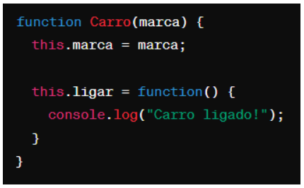

# Instruções

- Faça uma cópia deste arquivo .md para um repositório próprio
- Resolva as 6 questões objetivas assinalando a alternativa correta
- Resolva as 4 questões dissertativas escrevendo no próprio arquivo .md
  - lembre-se de utilizar as estruturas de código como ``esta aqui com ` `` ou
```javascript
//esta aqui com ```
let a = "olá"
let b = 10
print(a)
```
- Resolva as questões com uso do Visual Studio Code ou ambiente similar.
- Teste seus códigos antes de trazer a resposta para cá.
- Cuidado com ChatGPT e afins: entregar algo só para ganhar nota não faz você aprender e ficar mais inteligente. Não seja dependente da máquina!
- ao final, publique seu arquivo lista_01.md com as respostas em seu repositório, e envie o link pela Adalove. 

# Questões objetivas

**1)** O que o código a seguir faz?


Escolha a opção que responde corretamente:

**a) Imprime os números pares de 1 a 10.**

b) Imprime os números ímpares de 1 a 10.

c) Imprime os números pares de 2 a 10.

d) Imprime os números ímpares de 2 a 10.

Resposta: a
______

**2)** Identificar a linha que falta no código para criar uma classe Veiculo com atributo marca, e uma classe Carro que herda de Veiculo com um método ligar(). 


No lugar onde está escrito “// linha” qual das opções abaixo deve estar para funcionar corretamente o código?

**A) let carro = new Carro("Toyota");**

B) let ligar = new ligar("Toyota");

C) class Moto extends Veiculo {};

D) carro1.ligar();

Resposta: a
______

**3)** Qual é o valor de resultado após a execução deste código?


Escolha a opção que responde corretamente:

**A) 18**

B) 16

C) 14

D) 12

Resposta: a
______

**4)** Como você criaria um método `acelerar()` em uma classe `Carro`, que recebe um parâmetro `velocidade` e o adiciona a um atributo `velocidadeAtual`?

**A)** 

B) 

C) 

D) 

Resposta: a
______

**5)** Qual a forma correta de definir uma classe Carro em JavaScript, com um método ligar() e um atributo marca?

**A)** 

B) 

C) 

D) 

Resposta: a
______

**6)** Observe o código abaixo:


Qual será a saída do código acima?

**A) "Olá, meu nome é João. Olá, meu nome é Maria."**

B) "Olá, meu nome é ."

C) "João Maria"

D) "undefined undefined"

Resposta: a
______

# Questões dissertativas

**7)** Vamos criar um programa em JavaScript para entender classes, métodos e atributos!
Classe Animal:
- Crie uma classe chamada Animal.
- Adicione dois atributos: nome e idade.
- Adicione um método chamado descrever() na classe Animal.
  - Este método deve exibir no console uma descrição do animal com seu nome e idade.

Criando e manipulando Animais:
- Crie dois objetos da classe Animal: um chamado "cachorro" e outro "gato", com idades distintas.
- Para cada animal, chame o método descrever() para ver a descrição no console.

Dica: Utilize `console.log()` para exibir as informações!

```js
// criação da classe animal com os atributos nome e idade
class Animal{
    constructor(nome, idade){
        // declaração dos atributos
        this.nome = nome,
        this.idade = idade
    }

    // método para descrever o animal utilizando os atributos da classe
    descrever(){
        // mostra descrição no console
        console.log("O animal selecionado se chama " + this.nome + " e possui " + this.idade + " anos.")
    }
}

// criação dos dois animais diferentes
const animal1 = new Animal("cachorro", 12);
const animal2 = new Animal("gato", 5);

// uso do método descrever para ambos os animais
animal1.descrever();
animal2.descrever();
```

______

**8)** Nos últimos dias tivemos a oportunidade de ter contato com Programação Orientada a Objetos, e tivemos contato com o tema "herança". Herança é um princípio de orientação a objetos, que permite que classes compartilhem atributos e métodos. Ela é usada na intenção de reaproveitar código ou comportamento generalizado ou especializar operações ou atributos. Então vamos praticar esse conteúdo nessa questão.
Vamos criar um programa em JavaScript para entender classes, métodos, atributos e herança!

Classe Animal:
- Crie uma classe chamada Animal.
- Adicione dois atributos: nome e idade.
- Adicione um método descrever() que exiba no console uma descrição do animal com seu nome e idade.

Classe Gato (Herda de Animal):
- Crie uma classe chamada Gato que herda da classe Animal.
- Adicione um atributo extra cor específico para gatos.
- Adicione um método miar() que exiba no console o som que um gato faz.

Criando Animais:
- Crie dois objetos da classe Animal: um chamado cachorro e outro gato, com idades distintas.
- Para o gato, também defina a cor.

Chamando os Métodos:
- Para cada animal, chame o método descrever() para ver a descrição no console.
- Para o gato, chame o método miar() para "ouvir" o som que ele faz (é também para ver o som no console).

Dica: Utilize console.log() para exibir as informações!

```js
// criação da classe animal com os atributos nome e idade
class Animal{
    constructor(nome, idade){
        // declaração dos atributos
        this.nome = nome,
        this.idade = idade
    }

    // método para descrever o animal utilizando os atributos da classe
    descrever(){
        // mostra descrição no console
        console.log("O animal selecionado se chama " + this.nome + " e possui " + this.idade + " anos.")
    }
}

// criação da classe gato que herda da classe animal
class Gato extends Animal{
    constructor(nome, idade, cor){
        // criação dos atributos nome e idade da classe mãe
        super(nome, idade);
        this.cor = cor; // declaração do atributo cor
    }

    // função que representa o miado do gato
    miar(){
        // mostra o miado no console
        console.log("MIAAAAAAAAAAAAAU!")
    }
}

// criação dos dois animais diferentes
const animal1 = new Animal("cachorro", 12); // uso da classe animal
const animal2 = new Gato("gato", 5); // uso da classe gato

// uso do método descrever para ambos os animais
animal1.descrever();
animal2.descrever();

// uso do método miar para o animal declarado com a classe gato
animal2.miar();
```
______

**9)** Vamos criar um programa em JavaScript para somar notas!

Classe SomadorDeNotas:
- Crie uma classe chamada SomadorDeNotas.
- Adicione um atributo total inicializado com 0 para armazenar a soma das notas.

Método adicionarNota:
- Adicione um método chamado adicionarNota(nota) na classe SomadorDeNotas.
- Este método deve receber um parâmetro nota e somá-lo ao atributo total.

Criando o Somador e Adicionando Notas:
- Crie um objeto da classe SomadorDeNotas, chamado somador.
- Utilize o método adicionarNota(nota) para adicionar algumas notas ao somador.

Chamando o Método para Ver o Total:
- Após adicionar todas as notas, chame um método verTotal() para exibir o total das notas adicionadas.

Dica: Utilize console.log() para exibir as informações!

```js
// cria classe SomadorDeNotas
class SomadorDeNotas {
    // declaração do atributo total começando em 0
    constructor(){
        this.total = 0
    }
    
    // método para somar uma nota ao atributo total
    adicionarNota(nota){
        this.total += nota; // adição de nota para o atributo total
        console.log("Nota somada"); // confirma a adição via console
    }

    // método para mostrcar o total somado
    verTotal(){
        // uso do console para mostrar o atributo total junto a um texto
        console.log("Total da soma das notas: " + this.total)
    }
}

// criação de um objeto somador da classe SomadorDeNotas
const somador = new SomadorDeNotas();

// uso do método adicionarNotas para diferentes valores
somador.adicionarNota(10);
somador.adicionarNota(9);
somador.adicionarNota(8);
somador.adicionarNota(7);

// uso do método verTotal para mostrar a soma das notas inseridas
somador.verTotal();
```
______

**10)** Imagine que você está criando um programa em JavaScript para uma escola. Neste programa, existem diferentes tipos de funcionários, cada um com suas próprias características. Considere as seguintes classes:

Funcionário:
- atributo: Nome
- atributo: Idade
- atributo: Salário base
- método: calcularSalario() - Este método calcula o salário total do funcionário. Para cada tipo de funcionário, o cálculo será diferente.

Professor (herança de Funcionário):
- atributo: Disciplina
- atributo: Horas de aula por semana
- método: calcularSalario() - Para calcular o salário do professor, multiplicamos suas horas de aula pelo valor da hora/aula.

Agora, sua tarefa é escrever um código em JavaScript que crie as classes Funcionário e Professor, com suas características e métodos descritos acima. Depois de criar as classes, crie:
- Dois objetos do tipo Professor com informações fictícias.
- Para cada objeto, chame o método calcularSalario() e mostre o salário calculado no console.

Certifique-se de explicar cada parte do código utilizando comentários, explicando para que serve cada atributo e método, bem como a lógica por trás do cálculo de salário para o tipo de funcionário Professor.

```js
// criação da classe funcionário
class Funcionario {
    constructor(nome, idade, salarioBase){
        // declaração dos atributos nome, idade e salárioBase
        this.nome = nome;
        this.idade = idade;
        this.salarioBase = salarioBase;
    }
    // cria um método calcular salário
    calcularSalario(){
       /*calcularSalario é um método que se diferencia para diferentes tipos de funcionários e,
        portanto, se encontra vazio para ser sobre escrito por cada classe filho que herda de Funcionario*/  
    }
}

// declara classe professor que herda de funcionário
class Professor extends Funcionario {
    // declara os atributos referentes a classe mãe e os excluvivos (disciplina e horas semanais)

    /*Dentro deste programa, se assume que o salário base de um professor é definido pelo valor 
    que é pago por uma hora de aula, sendo usado como tal posteriormente para o cálculo do salário total*/
    constructor(nome, idade, salarioBase, disciplina, horasSemanais){
        super(nome, idade, salarioBase); // inicia os atributos da classe mãe
        this.disciplina = disciplina;
        this.horasSemanais = horasSemanais; // quantidade de horas semanais do professor
    }

    // criação do método para calcular o salário por cima do método original da classe mãe

    /* Seguindo as especificações da atividade, o mesmo deve ser calculado pela multiplicação das 
    horas semanais do professor (presentes no atributo horasSemanais) e o a relação de hora/aula 
    (presente no atributo salarioBase, como explicado anteriormente).
    Devido a essas condições, estamos de fato calculando o salário semanal do professor, em vez do 
    tradicional salário mensal, sendo um detalhe importante que não deve deixar de ser explicitado*/ 
    
    calcularSalario(){
        // faz o cálculo do salário do professor em uma variável salarioFinal
        var salarioFinal = this.salarioBase * this.horasSemanais;

        // escreve no console o salário calculado, especificando que se trata do salário semanal
        console.log("O salário semanal do professor de " + this.disciplina + " " + this.nome + " é de R$" + salarioFinal);
    }
}

// cria dois objetos da classe professor
const prof1 = new Professor("Telison Cunha", 43, 60, "matemática", 40);
const prof2 = new Professor("Joaquin Fernadez", 31, 40, "química", 40);

// uso do método calculaSalario para calcular e mostrar o salário total dos professores
prof1.calcularSalario()
prof2.calcularSalario()
```
